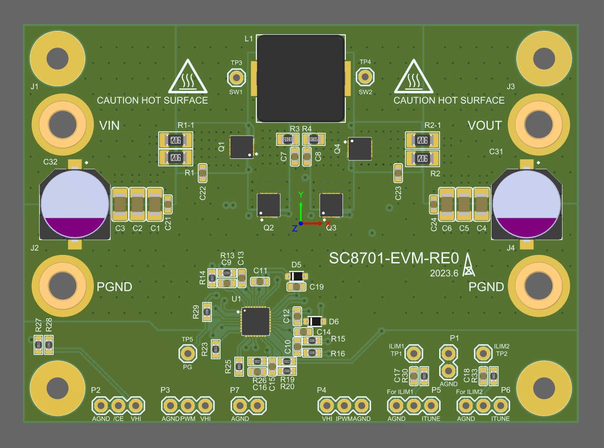
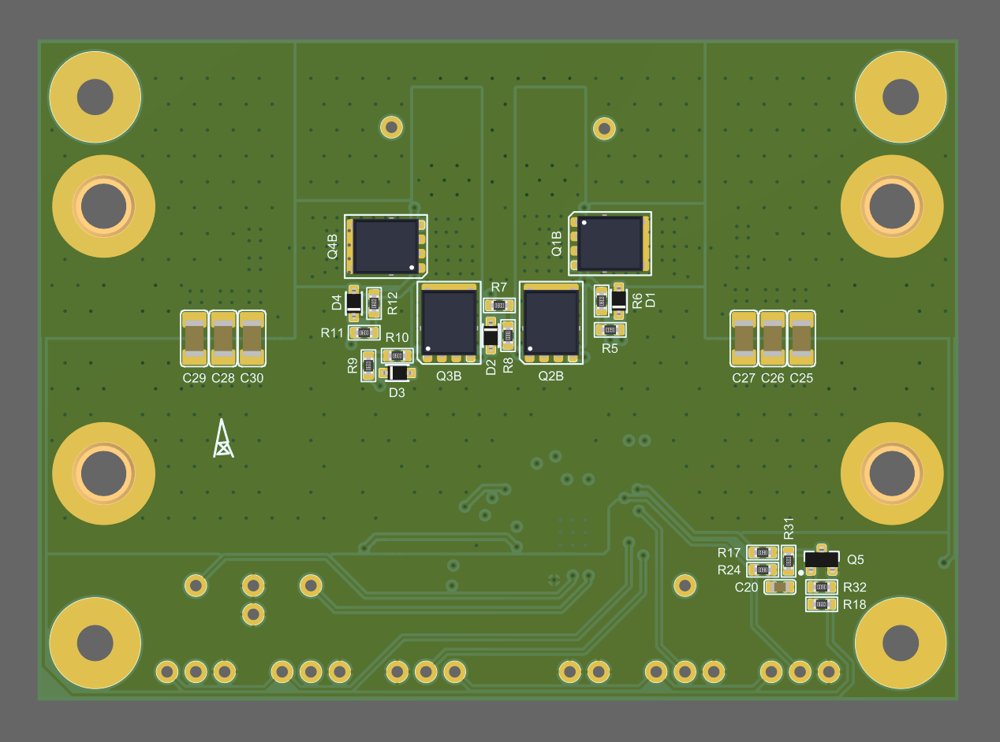
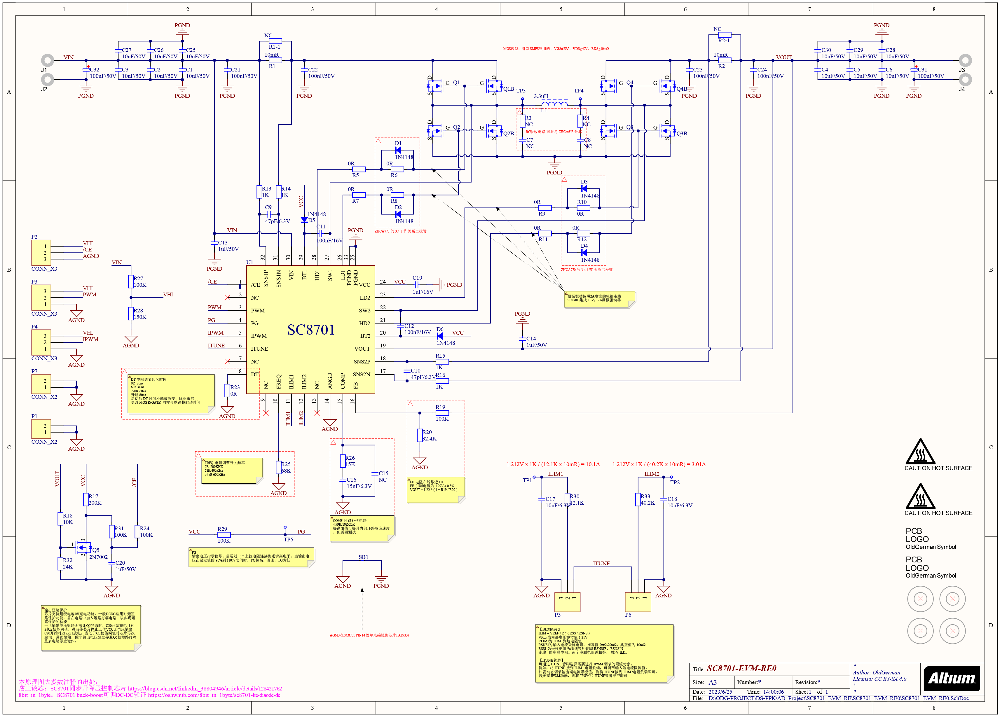

## SC8701_EVM_RE0

> 2023-06-07

准备测试测试 SC8701，由于全网找不到南芯 [SC8701 EVM 用户指南.PDF](http://dfsimg3.hqewimg.com/group1/M00/12/0D/wKhk7l1yGn2AXM5eAA1_OXSCO-Q478.pdf) 中的 PCB Altium 源文件（具体原因你懂的），我又不想去找代理软磨硬泡（还可能搞不到），网上还是可以找到一些开源的 SC8701 PCB，不料看了看血压又上升了，所以只能自己搞了，感谢 [唐老师](https://space.bilibili.com/28143041) 在 [开源南芯开关电源PCB](https://www.bilibili.com/video/BV1sY411A7DH/?spm_id_from=333.880.my_history.page.click&vd_source=e6ad3ca74f59d33bf575de5aa7ceb52e) 网盘资料中下载了一波2018年前的南芯官方评估版的Altium原始文件，但很可惜这里面并没有 SC8701 EVM，好在有个长得很相似的 SC8802 EVM，所以就其缝缝补补了一波得到 SC8701_EVM_RE0 ，本目录下即是其 Altium 源文件

|  |  |
| ------------------------------------- | ---------------------------------------- |

注：电源连接器使用 4mm香蕉插座10*7铜镀金U6047

## 感谢

- 唐老师讲电赛：

  > [四开关管BUCK-BOOST升降压电路PCB设计，上海南芯SC8802 SC8701...](https://www.bilibili.com/video/BV1zW4y1x7ws/?spm_id_from=333.880.my_history.page.click&vd_source=e6ad3ca74f59d33bf575de5aa7ceb52e)
  >
  > [BUCK降压电路RC吸收电路参数计算，汽车电子DCDC开关电源芯片EMI设计](https://www.bilibili.com/video/BV1iV411j7sj/)

- 詹工谈芯：[SC8701同步升降压控制芯片](https://blog.csdn.net/linkedin_38804946/article/details/128421762)

- 8bit_in_1byte：[SC8701 buck-boost可调DC-DC验证](https://oshwhub.com/8bit_in_1byte/sc8701-ke-diaodc-dc)