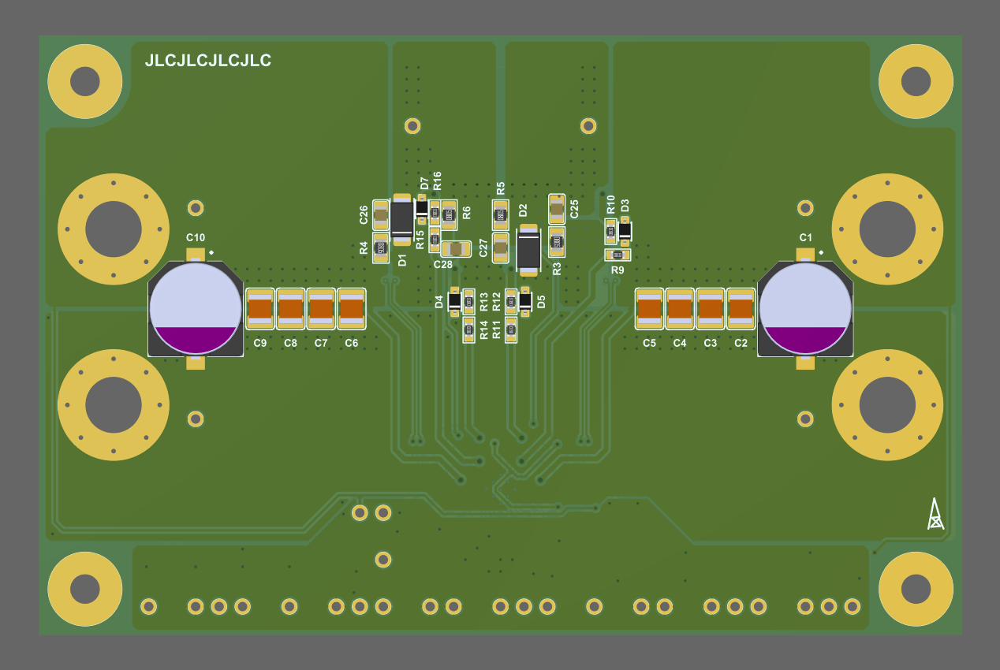

## SC8701-EVM-RE1

> 2023-06-17 ~ 2023-06-25

准备测试测试 SC8701，由于四层板的 [SC8701_EVM_RE0](https://github.com/oldgerman/SC8701_EVM_RE/SC8701_EVM_RE0) 有点奢侈，因此重新设计了一版 2层板的，本目录下即是其 Altium 源文件

|  |  |
| ---------------------------------------- | ------------------------------------------- |

注：2层板，电源连接器使用 4mm香蕉插座 安装开孔 M6 的任意型号

